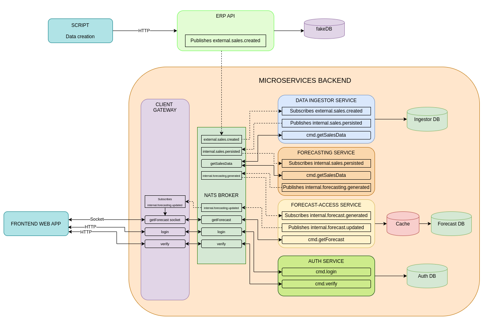

# AI Forecasting System

<!-- Languages & Frameworks -->


## Overview and Objectives

This project is a working prototype of an AI-based forecasting system designed to integrate with external systems (e.g., ERP). Whenever new sales data is saved, the system automatically updates the forecast model and generates a new prediction.

There are two goals behind this work:

- Product validation: explore the feasibility of an autonomous, real-time forecasting engine that could fit into a larger business application.
- Technical exploration: apply solid architectural principles and experiment with different technologies in a realistic context.

The result is a system that connects event-driven microservices, uses a lightweight time series model, and reacts to data changes instantly, demonstrating both product value and technical viability.


## Architecture

The system is composed of multiple services that communicate via NATS messaging. When new sales data is received from a mock ERP system, it’s stored in a database. A forecasting service listens for these events, updates the model, and returns a new forecast. Results are exposed through an API gateway and cached briefly to reduce redundant queries.

Some services follow Clean Architecture and TDD strictly; others adopt ideas from it where useful. The goal is clarity, testability, and separation of concerns, even if it adds some overhead in a small project.





## Design Decisions

- Python + FastAPI were used for the forecasting core to align with the AI tooling ecosystem.

- Prophet was selected as a simple and fast model to demonstrate the end-to-end forecasting pipeline. Currently, model parameters remain static across updates, but future iterations could incorporate adaptive training.

- NATS enables lightweight, event-based communication between services.

- NestJS + TypeScript powers the gateway and most of backend components for structured service development.

- MongoDB + PostgreSQL are used depending on service needs.

- Redis provides fast access to recent forecast results.

- Docker and Kubernetes were included to simulate a scalable, production-like environment, even if the project doesn’t demand it. This was also an opportunity to evaluate operational complexity.

Although some technology choices were made for experimentation, all services were built with product realism in mind. This is not a toy project, it simulates the behavior of a deployable forecasting engine that could be embedded into a larger software platform.


## Key Takeaways

- Product mindset: this project simulates a real-world need, automated forecasting triggered by business data changes. It’s designed as a functional prototype, not a technical demo.

- Technical leadership: services were structured using Clean Architecture principles where appropriate, showing an ability to balance best practices with pragmatism.

- System design: microservices, message queues, and caching were chosen not just for exploration, but to model how this system could scale and evolve in production.

- Cross-technology fluency: Combines several stacks (Python, TypeScript, FastAPI, NestJS, NATS, MongoDB, Redis, Kubernetes), showing flexibility and range across backend and infrastructure.

- Delivery: End-to-end implementation, from architecture and service design to deployment, was done independently, demonstrating initiative and execution.


## Disclaimer

This is a proof of concept. Some components are in an early or experimental stage, and the system is not intended for production use in its current form.

## Setup and Deployment

- Download git repo
```bash
git clone [repo_url]
git submodule update --init --recursive
```

- Create .env based on .env.template (Note: the MongoDB is the only external dependency, provide one)

```bash
docker compose up --build
```
